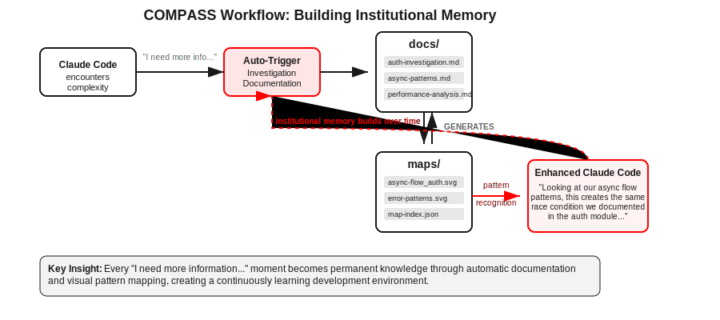

# COMPASS - Contextual Mapping & Pattern Analysis System

## The Hook: Why Leave Things to Chance?

Have you ever wanted your [Claude Code](https://github.com/anthropics/claude-code) environment to feel like a familiar friend with each session?

I built this kit because I was tired of watching brilliant AI get lost in the same mazes, iteration after iteration. Code presents us with endless puzzles - complex async flows, tangled dependencies, performance bottlenecks that seem to appear from nowhere. Without memory, without context, even the most sophisticated LLM can spiral into needless loops, suggesting the same debugging approaches that didn't work yesterday, or missing the patterns that would illuminate the path forward.

There's something almost tragic about watching an AI rediscover the same insights over and over, like a detective who burns their case notes each night. The breakthrough you had last week becomes tomorrow's mystery all over again.

## The Solution: What COMPASS Changes

COMPASS transforms Claude Code from a brilliant but forgetful assistant into something more like a seasoned colleague - one who remembers not just what you built, but *why* you built it that way. Who sees the subtle patterns that connect today's authentication bug to last month's race condition. Who builds institutional memory from every uncertainty, every investigation, every hard-won insight.

This isn't just about documentation. It's about creating a system that learns from its own limitations, that turns every "I need more information..." moment into permanent knowledge. When Claude Code hits the boundaries of what it can determine autonomously, COMPASS captures that uncertainty and transforms it into investigation frameworks for future encounters.

### What This Means For You

Instead of Claude Code starting fresh every time, COMPASS automatically:

1. **Remembers Previous Work** - Checks what you've already discovered about similar problems
2. **Applies Proven Patterns** - Uses approaches that worked before instead of reinventing solutions
3. **Identifies What's Missing** - Spots knowledge gaps that need investigation
4. **Provides Context-Rich Analysis** - Gives you answers informed by your project's history
5. **Builds Institutional Memory** - Captures everything for future use

**The result?** Your Claude Code environment becomes smarter with every interaction, like having a senior developer who never forgets lessons learned.

COMPASS operates on two foundational principles:

**Memory Through Documentation**: Every significant pattern, every architectural decision, every debugging breakthrough gets captured automatically. Not as static notes, but as living documentation that connects past insights to present challenges.

**Vision Through Mapping**: Complex code flows become visual landscapes. Race conditions reveal themselves as crossing paths. Bottlenecks appear as convergence points. The abstract becomes concrete, the invisible becomes navigable.



## The Experience Preview

Instead of explaining the same architectural decisions repeatedly, you'll find Claude Code saying things like:

*"Looking at our async flow patterns, this creates the same race condition we documented in the auth module. The investigation map suggests checking token refresh timing..."*

Instead of reinventing debugging approaches, it becomes:

*"Based on our previous memory leak investigation, this heap growth pattern matches what we tracked in the payment processing flow. Let me update our findings..."*

Your Claude Code environment grows more knowledgeable with each interaction, building the kind of institutional memory that usually takes teams years to develop.

## Use Cases: How COMPASS Actually Works

### The Automatic Experience

Here's the thing that makes COMPASS different from yet another tool you need to remember to use: **everything is automatic**. The `compass-handler.py` acts as a hook that puts itself first in line for complex analytical tasks. When Claude Code detects something that requires deeper investigation - debugging race conditions, understanding complex architectural decisions, mapping data flows - COMPASS automatically engages.

You don't need to invoke COMPASS. COMPASS detects complexity and invokes itself.

The `compass-captain` agent becomes your project's analytical conductor, orchestrating the entire investigation through a network of specialized agents. Think of it as having an experienced technical lead who knows exactly which team members to bring in for each type of challenge.

### Manual Agent Calling: When You Want Direct Control

While the automatic flow handles most scenarios, sometimes you want to call specific agents directly. Maybe you're planning a documentation strategy, or you want to validate SVG diagrams without triggering a full analysis cycle. Here are some thoughtful examples:

**Planning documentation for a complex feature**:

```
Use compass-doc-planning to create a documentation strategy for our new async processing pipeline
```

**Understanding existing patterns before building something new**:

```
Use compass-knowledge-query to find existing approaches to user authentication flows in our docs and maps
```

**Getting expert perspective on architectural decisions**:

```
Use compass-second-opinion to evaluate whether our microservices split makes sense given our team size and deployment complexity
```

**Analyzing data flows for a specific feature**:

```
Use compass-data-flow to map how user data moves through our payment processing pipeline
```

**Cross-referencing patterns after solving something**:

```
Use compass-cross-reference to connect our latest database optimization findings with existing performance patterns in the knowledge base
```

**Creating visual wire diagrams for complex processes**:

```
Use compass-data-flow to create a wire diagram showing how user requests flow through our microservices architecture, from API gateway through authentication, business logic, and database layers
```

This generates an SVG diagram that maps the complete request lifecycle - perfect for onboarding new developers or debugging performance issues. The visual representation makes it easier to spot bottlenecks, race conditions, and optimization opportunities that might be buried in code.

The beauty is that even when you call agents manually, they still contribute to the growing knowledge base. Your direct investigations become institutional memory that future automatic analysis can leverage.

---

Ready to dive deeper? **[Explore All The Compass Tools...](#agent-index-the-compass-crew)** to discover the complete network of specialized agents at your disposal.

## Technical Foundation: How It Works

### The Two-Directory Approach

```
docs/          # Textual institutional memory
maps/          # Visual pattern recognition
```

Your `docs/` directory evolves organically, growing smarter with each iteration. Claude Code automatically creates investigation documentation when it encounters uncertainty - those "I need more information..." moments become structured knowledge-gathering frameworks.

Your `maps/` directory captures the flows that text struggles to convey. SVG diagrams with machine-readable metadata let Claude Code recognize patterns visually, connecting similar flows across different parts of your codebase.

## Quick Start: Installation

### Unified Installation (1 step)

The COMPASS system now uses a single, unified launcher that handles everything automatically:

- **Install COMPASS with automatic setup**:

   ```bash
   curl -O https://raw.githubusercontent.com/odysseyalive/claude-compass/main/compass.sh
   ```

   ```bash
   chmod +x compass.sh
   ```

- **Rune Compass:**

   ```bash
   ./compass.sh
   ```

- **Resume previous sessions**:

   ```bash
   ./compass.sh --resume
   ```

- **Update to latest version (automatic)**:

   Every execution automatically checks for and installs the latest version of both COMPASS and its components.

Your Claude Code environment now has COMPASS capabilities and will initialize the `docs/` and `maps/` directories for the first complex analysis. No separate initialization commands needed - everything happens automatically.

### What the Unified Launcher Does

The `compass.sh` unified launcher revolutionizes the setup experience by automating everything that used to require manual steps:

**Auto-Update System**: Every execution automatically checks GitHub for the latest version and updates itself atomically with backup protection. No more manual update commands.

**Dependency Management**: Automatically validates and installs missing dependencies including `uvx`, `curl`, `python3`, and creates proper directory structures.

**Claude Code Integration**: Handles Claude Code installation via uvx, manages authentication setup for first-time users, and configures optimal settings automatically.

**Memory Optimization**: Detects system memory across platforms (Linux, macOS, Windows) and allocates 50% of available RAM to prevent heap crashes, with intelligent bounds (512MB minimum, 15GB maximum).

**Serena MCP Integration**: Automatically starts the Serena MCP server, registers it with Claude, monitors health in background, and provides recovery mechanisms for reliability.

**Process Management**: Implements comprehensive background process isolation, graceful cleanup on exit, and handles signal management to prevent orphaned processes.

## Enhanced Capabilities: Integration with Serena

**COMPASS reaches its full potential when paired with Serena** - an open-source coding agent toolkit that transforms any LLM into a fully-featured development assistant. Instead of working around the limitations of text-only analysis, Serena gives Claude Code semantic understanding of your codebase through Language Server Protocol (LSP) integration.

Serena transforms Claude Code from a conversation partner into a true development collaborator by providing IDE-like capabilities through the Model Context Protocol (MCP):

- **Semantic code analysis** through language servers for precise symbol-level understanding
- **LSP-powered navigation** that works like your favorite IDE - find definitions, references, completions
- **Multi-language support** including Python, TypeScript/JavaScript, PHP, Go, Rust, C#, Ruby, Swift, Java, and more
- **Symbolic code editing** - no more imprecise string replacements or line counting errors
- **Cross-project intelligence** that understands your entire codebase architecture

**Project**: <https://github.com/oraios/serena>

### What Serena Actually Provides

Unlike traditional development tools that require specific IDE configurations, Serena operates as an **MCP server** that any MCP-compatible client can connect to. This means:

- **Universal compatibility** - Works with Claude Code, Claude Desktop, Cursor, VSCode extensions, and any MCP client
- **Language server integration** - Uses the same LSP technology that powers modern IDEs
- **Semantic understanding** - Finds symbols, references, and relationships rather than just text patterns
- **Intelligent editing** - Edits code at the symbol level with tools like `insert_after_symbol` and `replace_symbol_body`
- **Free and open source** - No subscriptions, no API costs beyond your LLM usage

#### Core Dependencies (Required)

These are essential for any COMPASS + Serena setup and are automatically validated by the unified launcher:

- **Python 3.11+**: Serena's runtime requirement
- **uv package manager**: Modern Python package management that Serena depends on

  ```bash
  # Install uv if you don't have it (done automatically by compass.sh)
  curl -LsSf https://astral.sh/uv/install.sh | sh
  ```

- **Node.js** (includes npm): Required for TypeScript/JavaScript language server support

  ```bash
  # Recommended: Use nvm for version management
  curl -o- https://raw.githubusercontent.com/nvm-sh/nvm/v0.39.3/install.sh | bash
  source ~/.bashrc  # or restart your terminal
  nvm install 20  # LTS version
  nvm use 20
  ```

- **xmllint**: Critical for SVG validation - prevents broken visual maps that can derail pattern recognition

  ```bash
  # macOS
  brew install libxml2
  
  # Ubuntu/Debian
  sudo apt-get install libxml2-utils
  
  # Windows (via Chocolatey)
  choco install libxml2
  ```

#### Automatic Serena Integration

**The unified launcher handles all Serena integration automatically:**

1. **Availability Check**: Verifies uvx and Serena accessibility via GitHub
2. **Port Management**: Finds available ports starting from 9121, with conflict resolution
3. **Server Startup**: Launches Serena MCP server with proper timeout and health monitoring
4. **Claude Registration**: Registers the server with Claude's MCP system automatically
5. **Health Monitoring**: Starts background monitoring with automatic recovery
6. **Graceful Cleanup**: Implements comprehensive cleanup on exit and error conditions

You no longer need to manually configure MCP connections or manage server processes. The launcher handles everything, including edge cases like port conflicts, server failures, and process cleanup.

#### Language Server Integration

Serena automatically manages language servers for supported languages. When you activate a project, it:

- **Starts appropriate language servers** based on your project's languages
- **Provides semantic analysis** - understands your code structure, not just text
- **Enables intelligent navigation** - finds symbols, references, and definitions across your entire codebase
- **Supports multi-language projects** - handles polyglot codebases seamlessly

**Directly supported languages** (out of the box):

- Python, TypeScript/JavaScript, PHP (with Intelephense), Go, Rust, C#, Ruby, Swift, Java, Elixir, Clojure, Bash, C/C++

**Language-specific setup** (if you want premium features):

For **PHP with Intelephense premium features**:

```bash
# Set your license key as an environment variable
export INTELEPHENSE_LICENSE_KEY="your-license-key-here"
```

For **Go development**:

- `gopls` is automatically installed when needed

For **Java projects**:

- Java JDK 11+ recommended for optimal language server performance

### Setting Up Serena (Now Automatic)

The beauty of the unified launcher is that Serena setup is completely automatic. However, if you need manual control or want to understand what's happening behind the scenes:

#### Automatic Integration (Default)

When you run `./compass.sh`, it automatically:

- Downloads and runs the latest Serena
- Configures it for IDE-like assistance
- Activates your current project
- Provides semantic code analysis immediately
- Registers with Claude's MCP system
- Starts background health monitoring

#### Manual Integration (Advanced Users)

If you prefer to manage the server process yourself or need different configuration:

1. **Direct MCP Integration**:

   ```bash
   claude mcp add serena -- uvx --from git+https://github.com/oraios/serena serena start-mcp-server --context ide-assistant --project $(pwd)
   ```

2. **SSE Mode**:

   ```bash
   uvx --from git+https://github.com/oraios/serena serena start-mcp-server --transport sse --port 9121 --context ide-assistant
   claude mcp add serena --transport sse http://localhost:9121/sse
   ```

3. **Disable Automatic Integration**:

   ```bash
   ./compass.sh --disable-serena
   # Or set environment variable
   SERENA_INTEGRATION_DISABLED=true ./compass.sh
   ```

### Why This Integration Matters for COMPASS

With Serena providing semantic code understanding, COMPASS transforms from a documentation system into a true **institutional knowledge engine**:

- **Precise pattern recognition** - Serena understands code structure, so COMPASS can map architectural patterns accurately
- **Symbolic code analysis** - Instead of guessing at function boundaries, COMPASS knows exactly how your code is organized
- **Cross-reference precision** - Links between documentation and actual code become reliable and maintained
- **Architecture evolution tracking** - As Serena edits code symbolically, COMPASS automatically updates its understanding of your system

The combination means Claude Code doesn't just remember what you talked about - it understands how your actual codebase evolved and can make connections between abstract discussions and concrete implementation details.

## Advanced Features: Auto-Update and Process Management

### Self-Updating Architecture

The unified launcher implements a sophisticated auto-update system that keeps both COMPASS and its components current:

**GitHub Integration**: Automatically checks the latest release from the COMPASS repository using GitHub's API, with intelligent version comparison and semantic versioning support.

**Atomic Updates**: Downloads new versions to temporary directories, validates integrity, creates backups, and performs atomic replacement to prevent corruption during updates.

**Self-Restart**: After successful updates, the launcher restarts itself with all original arguments preserved, ensuring seamless continuity.

**Update Control**: Use `--debug` to disable auto-updates during development, or `--no-auto-update` to skip updates entirely for a session.

### Memory Optimization System

**Cross-Platform Detection**: Automatically detects system memory on Linux (`/proc/meminfo`), macOS (`sysctl`), and Windows (PowerShell WMI queries) with multiple fallback methods.

**Intelligent Allocation**: Calculates 50% of system RAM with bounds checking (512MB minimum, 15GB maximum) and exports `NODE_OPTIONS="--max-old-space-size=X"` for optimal V8 heap management.

**Process Isolation**: Implements proper process cleanup, signal handling, and file descriptor management to prevent memory conflicts with containerized environments.

### Background Process Management

**Health Monitoring**: Serena MCP server health is monitored by a completely isolated background process that implements exponential backoff recovery and degraded monitoring modes.

**Graceful Cleanup**: Comprehensive cleanup handles orphaned processes, stale PID files, port conflicts, and implements multiple cleanup strategies for reliability.

**Signal Handling**: Proper signal propagation and trap management ensures graceful shutdown under all exit conditions.

## Applications: Beyond the Codebase

COMPASS works beyond just coding. The same patterns that make sense of tangled code can organize complex research. The memory that stops you from debugging the same issue twice can stop you from chasing the same research rabbit holes.

Think about the researcher lost in conflicting sources, the analyst hitting the same dead ends, the writer starting from scratch with each new project. COMPASS turns these struggles into organized knowledge-building, whether you're tracking research papers, following policy changes, or pulling together insights from different fields.

### Expanding the Framework

**Research Projects**: Complex topics become easier to navigate. Different studies, changing methods, and connections between fields turn into clear visual frameworks.

**Document Work**: Large sets of documents reveal their patterns. Policy changes, contract comparisons, and tracking how things evolve become manageable instead of overwhelming.

**Business Analysis**: Market research, competitor tracking, and business intelligence build lasting knowledge that goes beyond individual reports.

**Writing Projects**: Your writing develops its own memory. Argument structures, story flows, and editorial decisions become reusable tools.

> **Artifact Integration Workflow**
>
> - **Create valuable insights** in Claude conversations
> - **Generate artifacts** for significant analysis or frameworks
>   - *"ex. Generate an artifact from the key takeaways of this conversation, including all relevant citations and URL references"*
> - **Download artifacts** as markdown files
> - **Place in `docs/` directory** with descriptive filenames
> - **Let COMPASS organize** into searchable, cross-referenced knowledge
>
> *Why this matters*: Your breakthrough insights from one conversation become permanent knowledge. The framework you developed for understanding market trends doesn't disappear when the chat ends - it becomes part of your growing toolkit.

The same visual mapping that shows code bottlenecks can show gaps in arguments. The same documentation that prevents technical problems can prevent knowledge problems. Every complex challenge you work through becomes a path for future understanding.

COMPASS doesn't care if you're debugging code or untangling policy contradictions. Both are patterns waiting to be recognized, mapped, and remembered.

## Agent Index: The COMPASS Crew

The `compass-captain` orchestrates a network of specialized agents, each focused on a specific aspect of analysis. Think of them as different experts you might call in for a complex project - each brings their own perspective and can also be called manually when you need targeted help.

### Core Methodology Agents

**compass-methodology-selector** - Strategic analysis planning. Determines the optimal approach (light, medium, or full methodology) based on task complexity and creates execution plans.

**compass-knowledge-query** - Institutional memory access. Searches existing `docs/` and `maps/` directories to understand what you already know before starting new analysis.

**compass-pattern-apply** - Pattern matching specialist. Takes documented approaches from your knowledge base and applies them to current challenges.

**compass-gap-analysis** - Knowledge gap identification. Finds what's missing from your current understanding and creates investigation frameworks.

**compass-enhanced-analysis** - Complete analysis execution. Performs the actual analysis with full institutional context and all discovered patterns.

**compass-cross-reference** - Pattern library maintenance. Links new findings with existing knowledge and updates the searchable pattern connections.

**compass-coder** - Implementation bridge. Connects analytical findings to actual code implementation when development work is needed.

### Specialist Analysis Agents

**compass-data-flow** - Data flow visualization. Maps how data moves through your systems, identifying bottlenecks and transformation points.

**compass-doc-planning** - Documentation strategy. Plans how to capture and organize new knowledge for future reference.

**compass-second-opinion** - Expert consultation. Provides historical expert perspectives when facing uncertain technical decisions.

**compass-todo-sync** - Progress tracking. Integrates COMPASS methodology with task management systems.

**compass-breakthrough-doc** - Innovation capture. Automatically documents significant breakthroughs and successful approaches.

**compass-upstream-validator** - Repository validation. Checks findings against upstream repositories when verification is needed.

### Domain Specialists

**Authentication & Security Trio**:

- **compass-auth-performance-analyst** - Authentication performance optimization
- **compass-auth-security-validator** - Security compliance and vulnerability assessment  
- **compass-auth-optimization-specialist** - Authentication implementation strategy

**Writing & Documentation Specialists**:

- **compass-writing-analyst** - Content analysis and voice consistency
- **compass-academic-analyst** - Academic memory palace integration
- **compass-memory-enhanced-writer** - Voice preservation across different content types

**Development Infrastructure**:

- **compass-dependency-tracker** - Dependency lifecycle management and compliance analysis

Each agent can be called individually when you need specific expertise, but they work together automatically when the `compass-captain` orchestrates a full analysis. The system scales from quick targeted help to comprehensive institutional analysis depending on what your project needs.

## Advanced Usage: Command Line Options

The unified launcher provides comprehensive control over all aspects of COMPASS execution:

### Basic Usage

```bash
./compass.sh                 # Standard launch with all automatic features
./compass.sh --resume        # Resume previous Claude session
./compass.sh --help          # Show comprehensive help and usage
./compass.sh --version       # Display version and system information
```

### Advanced Options

```bash
./compass.sh --debug         # Enable debug output, disable auto-update
./compass.sh --no-auto-update # Disable automatic script updates
./compass.sh --disable-serena # Skip Serena MCP server integration
```

### Environment Variables

```bash
# Disable Serena integration globally
SERENA_INTEGRATION_DISABLED=true ./compass.sh

# Enable debug mode
DEBUG=1 ./compass.sh

# Custom memory allocation (overrides automatic detection)
NODE_OPTIONS="--max-old-space-size=8192" ./compass.sh
```

### First-Time Setup Automation

For new users, the launcher automatically handles Claude Code initialization:

- **Detection**: Checks for existing Claude configuration
- **Authentication**: Guides through token setup vs. interactive login options
- **Configuration**: Creates necessary directories and settings files
- **Integration**: Configures COMPASS hooks and MCP connections

No manual `claude init` commands are needed - everything is handled automatically with user prompts only when choices are required.

## The Philosophy

COMPASS embodies a simple belief: that every challenge overcome should make the next challenge easier. That uncertainty should transform into knowledge. That the mazes we navigate today should become the maps that guide us tomorrow.

The unified launcher extends this philosophy to the infrastructure itself - setup should be automatic, updates should be seamless, and the tools should work reliably without constant maintenance. Technology should fade into the background, leaving you free to focus on the creative and analytical work that matters.

Because why leave things to chance when you can leave things to memory? And why spend time on setup when you could be building something amazing?

---

*"The path through complexity isn't about avoiding the maze - it's about building better maps. And having those maps update themselves."*


